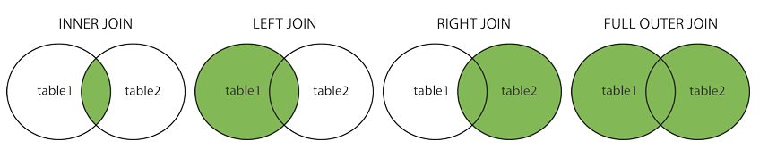
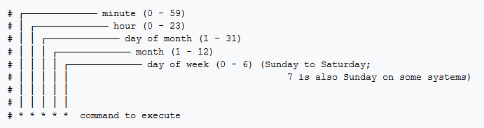

# Data Science Question Answer

The purpose of this repo is two fold:

* To help you (data science practitioners) prepare for data science related interviews
* To introduce to people who don't know but want to learn some basic data science concepts

The focus is on the knowledge breadth so this is more of a quick reference rather than an in-depth study material. If you want to learn a specific topic in detail please refer to other content or reach out and I'd love to point you to materials I found useful.

I might add some topics from time to time but hey, this should also be a community effort, right? Any pull request is welcome!

Here are the categorizes:

* [Resume](#resume)
* [SQL](#sql)
* [Tools and Framework](#tools-and-framework)
* [Statistics and ML In General](#statistics-and-ml-in-general)
* [Supervised Learning](#supervised-learning)
* [Unsupervised Learning](#unsupervised-learning)
* [Reinforcement Learning](#reinforcement-learning)
* [Natural Language Processing](#natural-language-processing)
* [System](#system)

## Resume

The only advice I can give about resume is to indicate your past data science / machine learning projects in a specific, **quantifiable** way. Consider the following two statements:

> Trained a machine learning system

and

> Designed and deployed a deep learning model to recognize objects using Keras, Tensorflow, and Node.js. The model has 1/30 model size, 1/3 training time, 1/5 inference time, and 2x faster convergence compared with traditional neural networks (e.g, ResNet)

The second is much better because it quantifies your contribution and also highlights specific technologies you used (and therefore have expertise in). This would require you to log what you've done during experiments. But don't exaggerate.

Spend some time going over your resume / past projects to make sure you explain them well.

## SQL

* [Difference between joins](#difference-between-joins)

### Difference between joins

* **(INNER) JOIN**: Returns records that have matching values in both tables
* **LEFT (OUTER) JOIN**: Return all records from the left table, and the matched records from the right table
* **RIGHT (OUTER) JOIN**: Return all records from the right table, and the matched records from the left table
* **FULL (OUTER) JOIN**: Return all records when there is a match in either left or right table

[back to top](#data-science-question-answer)

## Tools and Framework

The resources here are only meant to help you brush up on the topis rather than making you an expert.

* [Spark](#spark)

### Spark

Using PySpark API.

* The best resource is of course [Spark's documentation](https://spark.apache.org/docs/latest/). Take a thorough review of the topics
* If you are really time constrained, scan the Spark's documentation and check [PySpark cheat sheet](https://s3.amazonaws.com/assets.datacamp.com/blog_assets/PySpark_Cheat_Sheet_Python.pdf) for the basics

[back to top](#data-science-question-answer)

## Statistics and ML In General

* [Project Workflow](#project-workflow)
* [Cross Validation](#cross-validation)
* [Feature Importance](#feature-importance)
* [Mean Squared Error vs. Mean Absolute Error](#mean-squared-error-vs.-mean-absolute-error)
* [L1 vs L2 regularization](#l1-vs-l2-regularization)
* [Correlation vs Covariance](#correlation-vs-covariance)
* [Would adding more data address underfitting](#would-adding-more-data-address-underfitting)
* [Activation Function](#activation-function)
* [Bagging](#bagging)
* [Stacking](#stacking)
* [Generative vs discriminative](#generative-vs-discriminative)
* [Parametric vs Nonparametric](#parametric-vs-nonparametric)
* [Recommender System](#recommender-system)

### Project Workflow

Given a data science / machine learning project, what steps should we follow? Here's
how I would tackle it:

* **Specify business objective.** Are we trying to win more customers, achieve higher satisfaction, or gain more revenues?
* **Define problem.** What is the specific gap in your ideal world and the real one that requires machine learning to fill? Ask questions that can be addressed using your data and predictive modeling (ML algorithms).
* **Create a common sense baseline.** But before you resort to ML, set up a baseline to solve the problem as if you know zero data science. You may be amazed at how effective this baseline is. It can be as simple as recommending the top N popular items or other rule-based logic. This baseline can also server as a good benchmark for ML algorithms.
* **Review ML literatures.** To avoid reinventing the wheel and get inspired on what techniques / algorithms are good at addressing the questions using our data.
* **Set up a single-number metric.** What it means to be successful - high accuracy, lower error, or bigger AUC - and how do you measure it? The metric has to align with high-level goals, most often the success of your business. Set up a single-number against which all models are measured.
* **Do exploratory data analysis (EDA).** Play with the data to get a general idea of data type, distribution, variable correlation, facets etc. This step would involve a lot of plotting.
* **Partition data.** Validation set should be large enough to detect differences between the models you are training; test set should be large enough to indicate the overall performance of the final model; training set, needless to say, the larger the merrier.
* **Preprocess.** This would include data integration, cleaning, transformation, reduction, discretization and more.
* **Engineer features.** Coming up with features is difficult, time-consuming, requires expert knowledge. Applied machine learning is basically feature engineering. This step usually involves feature selection and creation, using domain knowledge. Can be minimal for deep learning projects.
* **Develop models.** Choose which algorithm to use, what hyperparameters to tune, which architecture to use etc.
* **Ensemble.** Ensemble can usually boost performance, depending on the correlations of the models/features. So it’s always a good idea to try out. But be open-minded about making tradeoff - some ensemble are too complex/slow to put into production.
* **Deploy model.** Deploy models into production for inference.
* **Monitor model.** Monitor model performance, and collect feedbacks.
* **Iterate.** Iterate the previous steps. Data science tends to be an iterative process, with new and improved models being developed over time.

[back to top](#data-science-question-answer)

### Cross Validation

Cross-validation is a technique to evaluate predictive models by partitioning the original sample into a training set to train the model, and a validation set to evaluate it. For example, a k-fold cross validation divides the data into k folds (or partitions), trains on each k-1 fold, and evaluate on the remaining 1 fold. This results to k models/evaluations, which can be averaged to get a overall model performance.

[back to top](#data-science-question-answer)

### Feature Importance

* In linear models, feature importance can be calculated by the scale of the coefficients
* In tree-based methods (such as random forest), important features are likely to appear closer to the root of the tree.  We can get a feature's importance for random forest by computing the averaging depth at which it appears across all trees in the forest.

[back to top](#data-science-question-answer)

### Mean Squared Error vs. Mean Absolute Error

* **Similarity**: both measure the average model prediction error; range from 0 to infinity; the lower the better
* Mean Squared Error (MSE) gives higher weights to large error (e.g., being off by 10 just MORE THAN TWICE as bad as being off by 5), whereas Mean Absolute Error (MAE) assign equal weights (being off by 10 is just twice as bad as being off by 5)
* MSE is continuously differentiable, MAE is not (where y_pred == y_true)

[back to top](#data-science-question-answer)

### L1 vs L2 regularization

* **Similarity**: both L1 and L2 regularization **prevent overfitting** by shrinking (imposing a penalty) on the coefficients
* **Difference**: L2 (Ridge) shrinks all the coefficient by the same proportions but eliminates none, while L1 (Lasso) can shrink some coefficients to zero, performing variable selection.
* **Which to choose**: If all the features are correlated with the label, ridge outperforms lasso, as the coefficients are never zero in ridge. If only a subset of features are correlated with the label, lasso outperforms ridge as in lasso model some coefficient can be shrunken to zero.
* In Graph (a), the black square represents the feasible region of the L1 regularization while graph (b) represents the feasible region for L2 regularization. The contours in the plots represent different loss values (for the unconstrained regression model ). The feasible point that minimizes the loss is more likely to happen on the coordinates on graph (a) than on graph (b) since graph (a) is more **angular**.  This effect amplifies when your number of coefficients increases, i.e. from 2 to 200. The implication of this is that the L1 regularization gives you sparse estimates. Namely, in a high dimensional space, you got mostly zeros and a small number of non-zero coefficients.

[back to top](#data-science-question-answer)

### Correlation vs Covariance

* Both determine the relationship and measure the dependency between two random variables
* Correlation is when the change in one item may result in the change in the another item, while covariance is when two items vary together (joint variability)
* Covariance is nothing but a measure of correlation. On the contrary, correlation refers to the scaled form of covariance
* Range: correlation is between -1 and +1, while covariance lies between negative infinity and infinity.

[back to top](#data-science-question-answer)

### Would adding more data address underfitting

Underfitting happens when a model is not complex enough to learn well from the data. It is the problem of model rather than data size. So a potential way to address underfitting is to increase the model complexity (e.g., to add higher order coefficients for linear model, increase depth for tree-based methods, add more layers / number of neurons for neural networks etc.)

[back to top](#data-science-question-answer)

### Activation Function

For neural networks

* Non-linearity: ReLU is often used. Use Leaky ReLU (a small positive gradient for negative input, say, `y = 0.01x` when x < 0) to address dead ReLU issue
* Multi-class: softmax
* Binary: sigmoid
* Regression: linear

[back to top](#data-science-question-answer)

### Bagging

To address overfitting, we can use an ensemble method called bagging (bootstrap aggregating),
which reduces the variance of the meta learning algorithm. Bagging can be applied
to decision tree or other algorithms.

Here is a [great illustration](http://scikit-learn.org/stable/auto_examples/ensemble/plot_bias_variance.html#sphx-glr-auto-examples-ensemble-plot-bias-variance-py) of a single estimator vs. bagging.

* Bagging is when samlping is performed *with* replacement. When sampling is performed *without* replacement, it's called pasting.
* Bagging is popular due to its boost for performance, but also due to that individual learners can be trained in parallel and scale well
* Ensemble methods work best when the learners are as independent from one another as possible
* Voting: soft voting (predict probability and average over all individual learners) often works better than hard voting
* out-of-bag instances can act validation set for bagging

[back to top](#data-science-question-answer)

### Stacking

* Instead of using trivial functions (such as hard voting) to aggregate the predictions from individual learners, train a model to perform this aggregation
* First split the training set into two subsets: the first subset is used to train the learners in the first layer
* Next the first layer learners are used to make predictions (meta features) on the second subset, and those predictions are used to train another models (to obtain the weigts of different learners) in the second layer
* We can train multiple models in the second layer, but this entails subsetting the original dataset into 3 parts

[back to top](#data-science-question-answer)

### Generative vs discriminative

* Discriminative algorithms model *p(y|x; w)*, that is, given the dataset and learned
parameter, what is the probability of y belonging to a specific class. A discriminative algorithm
doesn't care about how the data was generated, it simply categorizes a given example
* Generative algorithms try to model *p(x|y)*, that is, the distribution of features given
that it belongs to a certain class. A generative algorithm models how the data was
generated.

> Given a training set, an algorithm like logistic regression or
> the perceptron algorithm (basically) tries to find a straight line—that is, a
> decision boundary—that separates the elephants and dogs. Then, to classify
> a new animal as either an elephant or a dog, it checks on which side of the
> decision boundary it falls, and makes its prediction accordingly.

> Here’s a different approach. First, looking at elephants, we can build a
> model of what elephants look like. Then, looking at dogs, we can build a
> separate model of what dogs look like. Finally, to classify a new animal, we
> can match the new animal against the elephant model, and match it against
> the dog model, to see whether the new animal looks more like the elephants
> or more like the dogs we had seen in the training set.

[back to top](#data-science-question-answer)

### Parametric vs Nonparametric

* A learning model that summarizes data with a set of parameters of fixed size (independent of the number of training examples) is called a parametric model.
* A model where the number of parameters is not determined prior to training. Nonparametric does not mean that they have no parameters. On the contrary, nonparametric models (can) become more and more complex with an increasing amount of data.

[back to top](#data-science-question-answer)

### Recommender System

* I put recommend system here since technically it falls neither under supervised nor unsupervised learning
* A recommender system seeks to predict the 'rating' or 'preference' a user would give to items and then recommend items accordingly
* Content based recommender systems recommends items similar to those a given user has liked in the past, based on either explicit (ratings, like/dislike button) or implicit (viewed/finished an article) feedbacks. Content based recommenders work solely with the past interactions of a given user and do not take other users into consideration.
* Collaborative filtering is based on past interactions of the whole user base. There are two Collaborative filtering approaches: **item-based** or **user-based**
  - item-based: for user u, a score for an unrated item is produced by combining the ratings of users similar to u.
  - user-based:  a rating (u, i) is produced by looking at the set of items similar to i (interaction similarity), then the ratings by u of similar items are combined into a predicted rating
* In recommender systems traditionally matrix factorization methods are used, although we recently there are also deep learning based methods
* Cold start and sparse matrix can be issues for recommender systems
* Widely used in movies, news, research articles, products, social tags, music, etc.

[back to top](#data-science-question-answer)

## Supervised Learning

* [Linear regression](#linear-regression)
* [Logistic regression](#logistic-regression)
* [Naive Bayes](#naive-bayes)
* [KNN](#knn)
* [SVM](#svm)
* [Decision tree](#decision-tree)
* [Random forest](#random-forest)
* [Boosting Tree](#boosting-tree)
* [MLP](#mlp)
* [CNN](#cnn)
* [RNN and LSTM](#rnn-and-lstm)

### Linear regression

* How to learn the parameter: minimize the cost function
* How to minimize cost function: gradient descent
* Regularization:
    - L1 (Lasso): can shrink certain coef to zero, thus performing feature selection
    - L2 (Ridge): shrink all coef with the same proportion; almost always outperforms L1
    - Elastic Net: combined L1 and L2 priors as regularizer
* Assumes linear relationship between features and the label
* Can add polynomial and interaction features to add non-linearity

[back to top](#data-science-question-answer)

### Logistic regression

* Generalized linear model (GLM) for binary classification problems
* Apply the sigmoid function to the output of linear models, squeezing the target
to range [0, 1]
* Threshold to make prediction: usually if the output > .5, prediction 1; otherwise prediction 0
* A special case of softmax function, which deals with multi-class problems

[back to top](#data-science-question-answer)

### Naive Bayes

* Naive Bayes (NB) is a supervised learning algorithm based on applying [Bayes' theorem](https://en.wikipedia.org/wiki/Bayes%27_theorem)
* It is called naive because it builds the naive assumption that each feature
are independent of each other
* NB can make different assumptions (i.e., data distributions, such as Gaussian,
Multinomial, Bernoulli)
* Despite the over-simplified assumptions, NB classifier works quite well in real-world
applications, especially for text classification (e.g., spam filtering)
* NB can be extremely fast compared to more sophisticated methods

[back to top](#data-science-question-answer)

### KNN

* Given a data point, we compute the K nearest data points (neighbors) using certain
distance metric (e.g., Euclidean metric). For classification, we take the majority label
of neighbors; for regression, we take the mean of the label values.
* Note for KNN we don't train a model; we simply compute during
inference time. This can be computationally expensive since each of the test example
need to be compared with every training example to see how close they are.
* There are approximation methods can have faster inference time by
partitioning the training data into regions (e.g., [annoy](https://github.com/spotify/annoy))
* When K equals 1 or other small number the model is prone to overfitting (high variance), while
when K equals number of data points or other large number the model is prone to underfitting (high bias)

[back to top](#data-science-question-answer)

### SVM

* Can perform linear, nonlinear, or outlier detection (unsupervised)
* Large margin classifier: using SVM we not only have a decision boundary, but want the boundary
to be as far from the closest training point as possible
* The closest training examples are called support vectors, since they are the points
based on which the decision boundary is drawn
* SVMs are sensitive to feature scaling

[back to top](#data-science-question-answer)

### Decision tree

* Non-parametric, supervised learning algorithms
* Given the training data, a decision tree algorithm divides the feature space into
regions. For inference, we first see which
region does the test data point fall in, and take the mean label values (regression)
or the majority label value (classification).
* **Construction**: top-down, chooses a variable to split the data such that the
target variables within each region are as homogeneous as possible. Two common
metrics: gini impurity or information gain, won't matter much in practice.
* Advantage: simply to understand & interpret, mirrors human decision making
* Disadvantage:
    - can overfit easily (and generalize poorly) if we don't limit the depth of the tree
    - can be non-robust: A small change in the training data can lead to a totally different tree
    - instability: sensitive to training set rotation due to its orthogonal decision boundaries

[back to top](#data-science-question-answer)

### Random forest

Random forest improves bagging further by adding some randomness. In random forest,
only a subset of features are selected at random to construct a tree (while often not subsample instances).
The benefit is that random forest **decorrelates** the trees.

For example, suppose we have a dataset. There is one very predicative feature, and a couple
of moderately predicative features. In bagging trees, most of the trees
will use this very predicative feature in the top split, and therefore making most of the trees
look similar, **and highly correlated**. Averaging many highly correlated results won't lead
to a large reduction in variance compared with uncorrelated results.
In random forest for each split we only consider a subset of the features and therefore
reduce the variance even further by introducing more uncorrelated trees.

I wrote a [notebook](assets/bag-rf-var.ipynb) to illustrate this point.

In practice, tuning random forest entails having a large number of trees (the more the better, but
always consider computation constraint). Also, `min_samples_leaf` (The minimum number of
samples at the leaf node)to control the tree size and overfitting. Always cross validate the parameters.

[back to top](#data-science-question-answer)

### Boosting Tree

**How it works**

Boosting builds on weak learners, and in an iterative fashion. In each iteration,
a new learner is added, while all existing learners are kept unchanged. All learners
are weighted based on their performance (e.g., accuracy), and after a weak learner
is added, the data are re-weighted: examples that are misclassified gain more weights,
while examples that are correctly classified lose weights. Thus, future weak learners
focus more on examples that previous weak learners misclassified.

**Difference from random forest (RF)**

* RF grows trees **in parallel**, while Boosting is sequential
* RF reduces variance, while Boosting reduces errors by reducing bias

**XGBoost (Extreme Gradient Boosting)**

> XGBoost uses a more regularized model formalization to control overfitting, which gives it better performance

[back to top](#data-science-question-answer)

### MLP

A feedforward neural network of multiple layers. In each layer we
can have multiple neurons, and each of the neuron in the next layer is a linear/nonlinear
combination of the all the neurons in the previous layer. In order to train the network
we back propagate the errors layer by layer. In theory MLP can approximate any functions.

[back to top](#data-science-question-answer)

### CNN

The Conv layer is the building block of a Convolutional Network. The Conv layer consists
of a set of learnable filters (such as 5 * 5 * 3, width * height * depth). During the forward
pass, we slide (or more precisely, convolve) the filter across the input and compute the dot
product. Learning again happens when the network back propagate the error layer by layer.

Initial layers capture low-level features such as angle and edges, while later
layers learn a combination of the low-level features and in the previous layers
and can therefore represent higher level feature, such as shape and object parts.

[back to top](#data-science-question-answer)

### RNN and LSTM

RNN is another paradigm of neural network where we have difference layers of cells,
and each cell not only takes as input the cell from the previous layer, but also the previous
cell within the same layer. This gives RNN the power to model sequence.

This seems great, but in practice RNN barely works due to exploding/vanishing gradient, which
is cause by a series of multiplication of the same matrix. To solve this, we can use
a variation of RNN, called long short-term memory (LSTM), which is capable of learning
long-term dependencies.

The math behind LSTM can be pretty complicated, but intuitively LSTM introduce

* input gate
* output gate
* forget gate
* memory cell (internal state)

LSTM resembles human memory: it forgets old stuff (old internal state * forget gate)
and learns from new input (input node * input gate)

[back to top](#data-science-question-answer)

## Unsupervised Learning

* [Clustering](#clustering)
* [Principal Component Analysis](#principal-component-analysis)
* [Autoencoder](#autoencoder)
* [Generative Adversarial Network](#generative-adversarial-network)

### Clustering

* Clustering is a unsupervised learning algorithm that groups data in such
a way that data points in the same group are more similar to each other than to
those from other groups
* Similarity is usually defined using a distance measure (e.g, Euclidean, Cosine, Jaccard, etc.)
* The goal is usually to discover the underlying structure within the data (usually high dimensional)
* The most common clustering algorithm is K-means, where we define K (the number of clusters)
and the algorithm iteratively finds the cluster each data point belongs to

[scikit-learn](http://scikit-learn.org/stable/modules/clustering.html) implements many clustering algorithms. Below is a comparison adopted from its page.

[back to top](#data-science-question-answer)

### Principal Component Analysis

* Principal Component Analysis (PCA) is a dimension reduction technique that projects
the data into a lower dimensional space
* PCA uses Singular Value Decomposition (SVD), which is a matrix factorization method
that decomposes a matrix into three smaller matrices (more details of SVD [here](https://en.wikipedia.org/wiki/Singular-value_decomposition))
* PCA finds top N principal components, which are dimensions along which the data vary
(spread out) the most. Intuitively, the more spread out the data along a specific dimension,
the more information is contained, thus the more important this dimension is for the
pattern recognition of the dataset
* PCA can be used as pre-step for data visualization: reducing high dimensional data
into 2D or 3D. An alternative dimensionality reduction technique is [t-SNE](https://lvdmaaten.github.io/tsne/)

Here is a visual explanation of PCA

[back to top](#data-science-question-answer)

### Autoencoder

* The aim of an autoencoder is to learn a representation (encoding) for a set of data
* An autoencoder always consists of two parts, the encoder and the decoder. The encoder would find a lower dimension representation (latent variable) of the original input, while the decoder is used to reconstruct from the lower-dimension vector such that the distance between the original and reconstruction is minimized
* Can be used for data denoising and dimensionality reduction

### Generative Adversarial Network

* Generative Adversarial Network (GAN) is an unsupervised learning algorithm that also has supervised flavor: using supervised loss as part of training
* GAN typically has two major components: the **generator** and the **discriminator**. The generator tries to generate "fake" data (e.g, images or sentences) that fool the discriminator into thinking that they're real, while the discriminator tries to distinguish between real and generated data. It's a fight between the two players thus the name adversarial, and this fight drives both sides to improve until "fake" data are indistinguishable from the real data
* How does it work, intuitively
	- The generator takes a **random** input and generates a sample of data
	- The discriminator then either takes the generated sample or a real data sample, and tries to predict whether the input is real or generated (i.e., solving a binary classification problem)
	- Given a truth score range of [0, 1], ideally the we'd love to see discriminator give low score to generated data but high score to real data. On the other hand, we also wanna see the generated data fool the discriminator. And this paradox drives both sides become stronger
* How does it work, from a training perspective
	- Without training, the generator creates 'garbage' data only while the discriminator is too 'innocent' to tell the difference between fake and real data
	- Usually we would first train the discriminator with both real (label 1) and generated data (label 0) for N epochs so it would have a good judgement of what is real vs. fake
	- Then we **set the discriminator non-trainable**, and train the generator. Even though the discriminator is non-trainable at this stage, we still use it as a classifier so that **error signals can be back propagated and therefore enable the generator to learn**
	- The above two steps would continue in turn until both sides cannot be improved further
* Here are some [tips and tricks to make GANs work](https://github.com/soumith/ganhacks)
* One Caveat is that the **adversarial part is only auxiliary: The end goal of using GAN is to generate data that even experts cannot tell if it's real or fake**

[back to top](#data-science-question-answer)

## Reinforcement Learning

[TODO]

## Natural Language Processing

* [Tokenization](#tokenization)
* [Stemming and lemmatization](#stemming-and-lemmatization)
* [N-gram](#ngram)
* [Bag of Words](#bag-of-words)
* [word2vec](#word2vec)

### Tokenization

* Tokenization is the process of converting a sequence of characters into a sequence of tokens
* Consider this example: `The quick brown fox jumped over the lazy dog`. In this case each word (separated by space) would be a token
* Sometimes tokenization doesn't have a definitive answer. For instance, `O'Neill` can be tokenized to `o` and `neill`, `oneill`, or `o'neill`.
* In some cases tokenization requires language-specific knowledge. For example, it doesn't make sense to tokenize `aren't` into `aren` and `t`
* For a more detailed treatment of tokenization please check [here](https://nlp.stanford.edu/IR-book/html/htmledition/tokenization-1.html)

[back to top](#data-science-question-answer)

### Stemming and lemmatization

* The goal of both stemming and lemmatization is to reduce inflectional forms and sometimes derivationally related forms of a word to a common base form
* Stemming usually refers to a crude heuristic process that chops off the ends of words
* Lemmatization usually refers to doing things properly with the use of a vocabulary and morphological analysis of words
* If confronted with the token `saw`, stemming might return just `s`, whereas lemmatization would attempt to return either `see` or `saw` depending on whether the use of the token was as a verb or a noun
* For a more detailed treatment please check [here](https://nlp.stanford.edu/IR-book/html/htmledition/stemming-and-lemmatization-1.html)

[back to top](#data-science-question-answer)

### N gram

* n-gram is a contiguous sequence of n items from a given sample of text or speech
* An n-gram of size 1 is referred to as a "unigram"; size 2 is a "bigram" size 3 is a "trigram". Larger sizes are sometimes referred to by the value of n in modern language, e.g., "four-gram", "five-gram", and so on.
* Consider this example: `The quick brown fox jumped over the lazy dog.`
  - bigram would be `the quick`, `quick brown`, `brown fox`, ..., i.e, every two consecutive words (or tokens)
  - trigram would be `the quick brown`, `quick brown fox`, `brown fox jumped`, ..., i.e., every three consecutive words (or tokens)
* ngram model models sequence, i.e., predicts next word (n) given previous words (1, 2, 3, ..., n-1)
* multiple gram (bigram and above) captures **context**
* to choose n in n-gram requires experiments and making tradeoff between stability of the estimate against its appropriateness. Rule of thumb: trigram is a common choice with large training corpora (millions of words), whereas a bigram is often used with smaller ones.
* n-gram can be used as features for machine learning and downstream NLP tasks

[back to top](#data-science-question-answer)

### Bag of Words

* Why? Machine learning models cannot work with raw text directly; rather, they take numerical values as input.
* Bag of words (BoW) builds a **vocabulary** of all the unique words in our dataset, and associate a unique index to each word in the vocabulary
* It is called a "bag" of words, because it is a representation that completely ignores the order of words
* Consider this example of two sentences: (1) `John likes to watch movies, especially horor movies.`, (2) `Mary likes movies too.` We would first build a vocabulary of unique words (all lower cases and ignoring punctuations): `[john, likes, to, watch, movies, especially, horor, mary, too]`. Then we can represent each sentence using term frequency, i.e, the number of times a term appears. So (1) would be `[1, 1, 1, 1, 2, 1, 1, 0, 0]`, and (2) would be `[0, 1, 0, 0, 1, 0, 0, 1, 1]`
* A common alternative to the use of dictionaries is the [hashing trick](https://en.wikipedia.org/wiki/Feature_hashing), where words are directly mapped to indices with a hashing function
* As the vocabulary grows bigger (tens of thousand), the vector to represent short sentences / document becomes sparse (almost all zeros)

[back to top](#data-science-question-answer)

### word2vec

* Shallow, two-layer neural networks that are trained to construct linguistic context of words
* Takes as input a large corpus, and produce a vector space, typically of several hundred
dimension, and each word in the corpus is assigned a vector in the space
* The key idea is **context**: words that occur often in the same context should have same/opposite
meanings.
* Two flavors
    - continuous bag of words (CBOW): the model predicts the current word given a window of surrounding context words
    - skip gram: predicts the surrounding context words using the current word

[back to top](#data-science-question-answer)

## System

* [Cron job](#cron-job)
* [Linux](#linux)

### Cron job

The software utility **cron** is a **time-based job scheduler** in Unix-like computer operating systems. People who set up and maintain software environments use cron to schedule jobs (commands or shell scripts) to run periodically at fixed times, dates, or intervals. It typically automates system maintenance or administration -- though its general-purpose nature makes it useful for things like downloading files from the Internet and downloading email at regular intervals.

Tools:
* [Apache Airflow](https://airflow.apache.org/)

[back to top](#data-science-question-answer)

### Linux

Using **Ubuntu** as an example.

* Become root: `sudo su`
* Install package: `sudo apt-get install <package>`

[back to top](#data-science-question-answer)

Confession: some images are adopted from the internet without proper credit. If you are the author and this would be an issue for you, please let me know.
